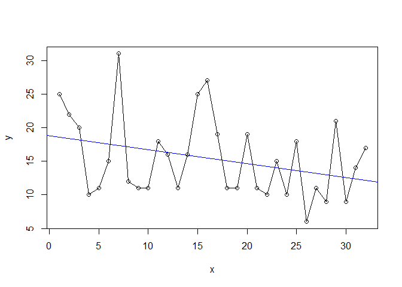

Power of t-test of regression slope coefficient
================
Nayef
3/28/2022

-   [1 Overview](#overview)
-   [2 Libraries](#libraries)
-   [3 Analysis](#analysis)

# 1 Overview

Traditional NHST has a lot of issues - e.g. see [this list](). One of
these is that statistical significance tends to be over-interpreted in
low-powered studies. This post examines the problem of how to determine
the power associated with the t-test of a regression coefficient.

Related links:

-   Post-hoc power is kinda useless

# 2 Libraries

``` r
library(powerMediation)
```

    ## Warning: package 'powerMediation' was built under R version 4.0.4

# 3 Analysis

``` r
y <- c(25L, 22L, 20L, 10L, 11L, 15L, 31L, 12L, 11L, 11L, 18L, 16L, 11L, 
       16L, 25L, 27L, 19L, 11L, 11L, 19L, 11L, 10L, 15L, 10L, 18L, 6L, 
       11L, 9L, 21L, 9L, 14L, 17L)
x <- seq(1:32)
stopifnot(length(x) == length(y))

m <- lm(y~x)

plot(x, y)
lines(y)
abline(m, col = "blue")
```

<!-- -->

``` r
var_y <- var(y)
sd_y <- sd(y)

var_x <- var(x)
sd_x <- sd(x)

power <- power.SLR(n=32, 
                   lambda.a = -.2,  # try -.293
                   sigma.x = sd_x, 
                   sigma.y = sd_y, 
                   alpha = .05, 
                   verbose = TRUE)
```

    ## [1] 0.4253301

**The power is 0.425**
