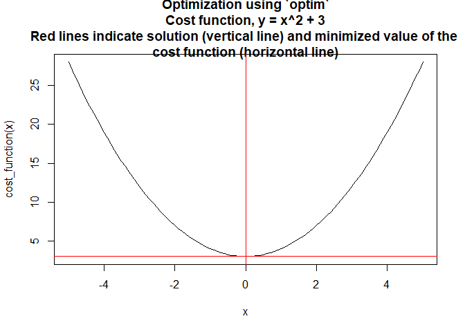
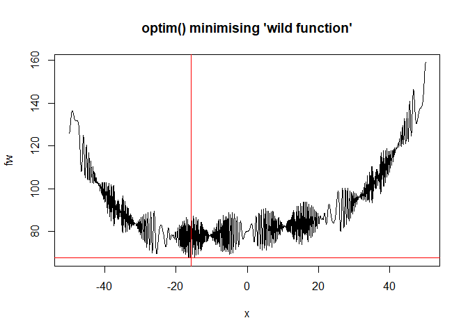
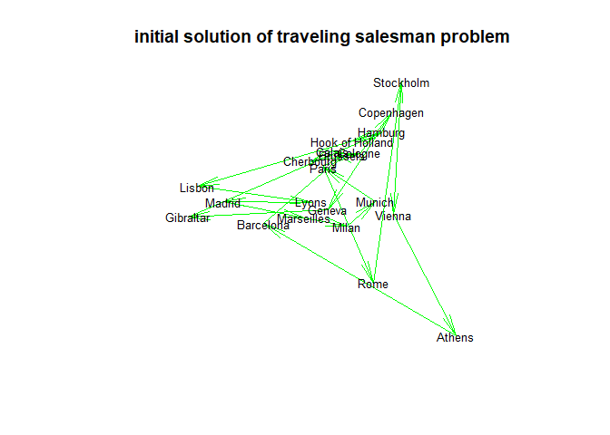
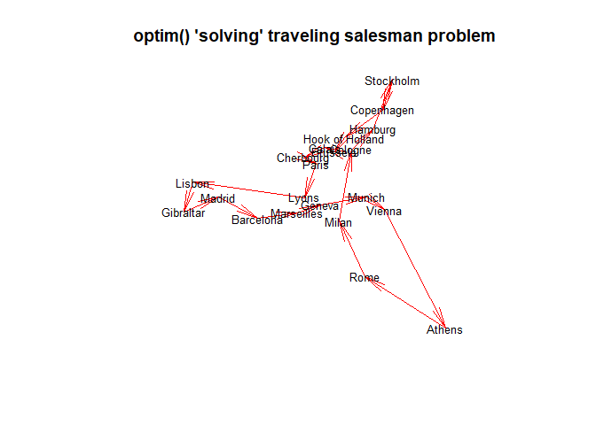

Optimization with the optim function
================
Nayef
11/28/2022

-   [1 Overview](#overview)
    -   [1.1 References:](#references)
-   [2 Example 1: Basic quadratic
    function](#example-1-basic-quadratic-function)
-   [3 Example 2: “Wild” function](#example-2-wild-function)
-   [4 Example 3: Traveling salesperson
    problem](#example-3-traveling-salesperson-problem)

# 1 Overview

This shows simple examples of how to use the `optim` function in base R.
In Example 1, the cost function is a real-valued function of a single
variable. It’s very easy to pass this function and a starting guess to
`optim`, and to retrieve the solution.

There are a few other examples from the `optim` help and from the first
blog post in the reference below (Mage’s blog).

## 1.1 References:

-   [Mage’s blog: How to use optim in
    R](https://www.magesblog.com/post/2013-03-12-how-to-use-optim-in-r/)
-   [optim
    docs](https://www.rdocumentation.org/packages/stats/versions/3.6.2/topics/optim)

# 2 Example 1: Basic quadratic function

Set up the cost function to minimize.

``` r
cost_function <- function(x){
  return(x^2 + 3)
}
```

Pass it to `optim`.

``` r
starting_guess = 50  # arbitrary 

tryCatch(
  # try calling optim without args:
  # This will warn against using Nelder-Mead method. 
  optim(cost_function), 
  
  # catch warning: 
  warning = function(w){w}, 
  
  # "except" block: call optim with method = Brent    
  finally <<- optim(par = starting_guess,
                    fn = cost_function,
                    method = "Brent",
                    lower = -100, 
                    upper = 100)
)
```

    ## <simpleWarning in optim(cost_function): one-dimensional optimization by Nelder-Mead is unreliable:
    ## use "Brent" or optimize() directly>

``` r
print(finally)
```

    ## $par
    ## [1] 9.934104e-09
    ## 
    ## $value
    ## [1] 3
    ## 
    ## $counts
    ## function gradient 
    ##       NA       NA 
    ## 
    ## $convergence
    ## [1] 0
    ## 
    ## $message
    ## NULL

Let’s plot the result:

``` r
text = "Optimization using `optim`"
text = paste0(text, "\nCost function, y = x^2 + 3")
text = paste0(text, "\nRed lines indicate solution (vertical line) and ")
text = paste0(text, "minimized value of the \ncost function (horizontal line)")

curve(cost_function, from = -5, to = 5, main = text)
abline(v = finally$par, col = "red")
abline(h = finally$value, col = "red")
```

<!-- -->

Looks like it did a pretty good job!

# 3 Example 2: “Wild” function

This is from the optim docs.

``` r
fw <- function(x)
    10*sin(0.3*x)*sin(1.3*x^2) + 0.00001*x^4 + 0.2*x + 80
res <- optim(50, fw, method = "SANN",
             control = list(maxit = 20000, temp = 20, parscale = 20))
res
```

    ## $par
    ## [1] -15.81505
    ## 
    ## $value
    ## [1] 67.46782
    ## 
    ## $counts
    ## function gradient 
    ##    20000       NA 
    ## 
    ## $convergence
    ## [1] 0
    ## 
    ## $message
    ## NULL

``` r
plot(fw, -50, 50, n = 1000, main = "optim() minimising 'wild function'")
abline(v = res$par, col = "red")
abline(h = res$value, col = "red")
```

<!-- -->

# 4 Example 3: Traveling salesperson problem

This is from the optim docs.

``` r
library(stats) # normally loaded

eurodistmat <- as.matrix(eurodist)

distance <- function(sq) {  # Target function
    sq2 <- embed(sq, 2)
    sum(eurodistmat[cbind(sq2[,2], sq2[,1])])
}

genseq <- function(sq) {  # Generate new candidate sequence
    idx <- seq(2, NROW(eurodistmat)-1)
    changepoints <- sample(idx, size = 2, replace = FALSE)
    tmp <- sq[changepoints[1]]
    sq[changepoints[1]] <- sq[changepoints[2]]
    sq[changepoints[2]] <- tmp
    sq
}

sq <- c(1:nrow(eurodistmat), 1)  # Initial sequence: alphabetic
distance(sq)
```

    ## [1] 29625

``` r
# rotate for conventional orientation
loc <- -cmdscale(eurodist, add = TRUE)$points
x <- loc[,1]; y <- loc[,2]
s <- seq_len(nrow(eurodistmat))
tspinit <- loc[sq,]

plot(x, y, type = "n", asp = 1, xlab = "", ylab = "",
     main = "initial solution of traveling salesman problem", axes = FALSE)
arrows(tspinit[s,1], tspinit[s,2], tspinit[s+1,1], tspinit[s+1,2],
       angle = 10, col = "green")
text(x, y, labels(eurodist), cex = 0.8)
```

<!-- -->

``` r
set.seed(123) # chosen to get a good soln relatively quickly
res <- optim(sq, distance, genseq, method = "SANN",
             control = list(maxit = 30000, temp = 2000, trace = TRUE,
                            REPORT = 500))
```

    ## sann objective function values
    ## initial       value 29625.000000
    ## iter     5000 value 13786.000000
    ## iter    10000 value 13647.000000
    ## iter    15000 value 13433.000000
    ## iter    20000 value 13433.000000
    ## iter    25000 value 13433.000000
    ## iter    29999 value 13433.000000
    ## final         value 13433.000000
    ## sann stopped after 29999 iterations

``` r
res  # Near optimum distance around 12842
```

    ## $par
    ##  [1]  1 19 16  6 10 20  7 11  3  4  5 18 13 12  9 14  2 15  8 17 21  1
    ## 
    ## $value
    ## [1] 13433
    ## 
    ## $counts
    ## function gradient 
    ##    30000       NA 
    ## 
    ## $convergence
    ## [1] 0
    ## 
    ## $message
    ## NULL

``` r
tspres <- loc[res$par,]
plot(x, y, type = "n", asp = 1, xlab = "", ylab = "",
     main = "optim() 'solving' traveling salesman problem", axes = FALSE)
arrows(tspres[s,1], tspres[s,2], tspres[s+1,1], tspres[s+1,2],
       angle = 10, col = "red")
text(x, y, labels(eurodist), cex = 0.8)
```

<!-- -->
