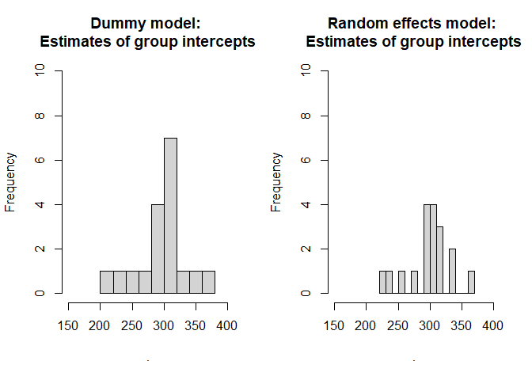

Random grouping factor vs dummy variable
================
Nayef
12/16/2022

-   [1 Overview](#overview)
    -   [1.1 References:](#references)
-   [2 Model 0: Using dummy variables for
    group](#model-0-using-dummy-variables-for-group)
-   [3 Model 1: Using random effect for
    group](#model-1-using-random-effect-for-group)
-   [4 Plots](#plots)

# 1 Overview

## 1.1 References:

-   [Stackexchange
    post](#%20https://stats.stackexchange.com/questions/507518/is-a-random-intercept-model-exactly-the-same-as-a-linear-model-with-dummy-variab)

``` r
library(lme4)
```

    ## Warning: package 'lme4' was built under R version 4.0.3

    ## Loading required package: Matrix

``` r
library(magrittr)
```

    ## Warning: package 'magrittr' was built under R version 4.0.3

``` r
library(dplyr)
```

    ## Warning: package 'dplyr' was built under R version 4.0.3

    ## 
    ## Attaching package: 'dplyr'

    ## The following objects are masked from 'package:stats':
    ## 
    ##     filter, lag

    ## The following objects are masked from 'package:base':
    ## 
    ##     intersect, setdiff, setequal, union

``` r
x_range <- c(150, 400)
y_range <- c(0, 10) 
```

# 2 Model 0: Using dummy variables for group

``` r
m0_dummy <- lm(Reaction ~ Subject, data = sleepstudy)
summary(m0_dummy)
```

    ## 
    ## Call:
    ## lm(formula = Reaction ~ Subject, data = sleepstudy)
    ## 
    ## Residuals:
    ##      Min       1Q   Median       3Q      Max 
    ## -115.744  -24.603   -3.719   23.001  146.860 
    ## 
    ## Coefficients:
    ##             Estimate Std. Error t value Pr(>|t|)    
    ## (Intercept)  342.134     13.996  24.445  < 2e-16 ***
    ## Subject309  -126.901     19.793  -6.411 1.51e-09 ***
    ## Subject310  -111.133     19.793  -5.615 8.37e-08 ***
    ## Subject330   -38.912     19.793  -1.966  0.05101 .  
    ## Subject331   -32.698     19.793  -1.652  0.10048    
    ## Subject332   -34.832     19.793  -1.760  0.08033 .  
    ## Subject333   -25.976     19.793  -1.312  0.19126    
    ## Subject334   -46.832     19.793  -2.366  0.01916 *  
    ## Subject335   -92.064     19.793  -4.651 6.81e-06 ***
    ## Subject337    33.587     19.793   1.697  0.09164 .  
    ## Subject349   -66.299     19.793  -3.350  0.00101 ** 
    ## Subject350   -28.531     19.793  -1.441  0.15139    
    ## Subject351   -52.036     19.793  -2.629  0.00939 ** 
    ## Subject352    -4.712     19.793  -0.238  0.81212    
    ## Subject369   -36.099     19.793  -1.824  0.07002 .  
    ## Subject370   -50.432     19.793  -2.548  0.01177 *  
    ## Subject371   -47.150     19.793  -2.382  0.01837 *  
    ## Subject372   -24.248     19.793  -1.225  0.22234    
    ## ---
    ## Signif. codes:  0 '***' 0.001 '**' 0.01 '*' 0.05 '.' 0.1 ' ' 1
    ## 
    ## Residual standard error: 44.26 on 162 degrees of freedom
    ## Multiple R-squared:  0.4413, Adjusted R-squared:  0.3826 
    ## F-statistic: 7.526 on 17 and 162 DF,  p-value: 1.751e-13

``` r
df_m0_coef <- m0_dummy$coefficients %>% as.data.frame()
baseline_intercept <- df_m0_coef[1,1]
df_m0_coef <- df_m0_coef %>% 
  mutate(group_intercept = ifelse(. != baseline_intercept,
                                  baseline_intercept + .,
                                  .)) %>% 
  select(group_intercept)
```

# 3 Model 1: Using random effect for group

``` r
m1_random_effects <- lmer(Reaction ~ 1 + (1 | Subject), data = sleepstudy)
summary(m1_random_effects)
```

    ## Linear mixed model fit by REML ['lmerMod']
    ## Formula: Reaction ~ 1 + (1 | Subject)
    ##    Data: sleepstudy
    ## 
    ## REML criterion at convergence: 1904.3
    ## 
    ## Scaled residuals: 
    ##     Min      1Q  Median      3Q     Max 
    ## -2.4983 -0.5501 -0.1476  0.5123  3.3446 
    ## 
    ## Random effects:
    ##  Groups   Name        Variance Std.Dev.
    ##  Subject  (Intercept) 1278     35.75   
    ##  Residual             1959     44.26   
    ## Number of obs: 180, groups:  Subject, 18
    ## 
    ## Fixed effects:
    ##             Estimate Std. Error t value
    ## (Intercept)   298.51       9.05   32.98

``` r
df_m1_coef <- coef(m1_random_effects)$Subject
```

# 4 Plots

``` r
par(mfrow = c(1, 2))

df_m0_coef$group_intercept %>% 
  hist(xlim = x_range, ylim = y_range, breaks = 10, 
       main = 'Dummy model: \nEstimates of group intercepts')

df_m1_coef$`(Intercept)` %>% 
  hist(xlim = x_range, ylim = y_range, breaks = 10, 
       main = 'Random effects model: \nEstimates of group intercepts')
```

<!-- -->
