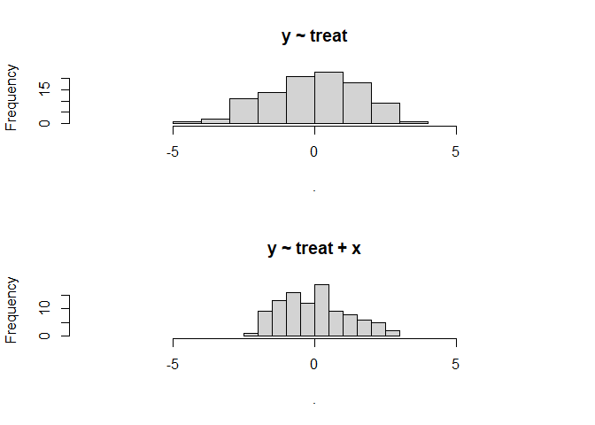

Omitted variable variance inflation
================
Nayef
2/9/2023

-   [1 Overview](#overview)
    -   [1.1 References:](#references)

# 1 Overview

Even with perfect randomization there can be advantages to including
additional covariates/predictors. I like to think of this as “omitted
variable variance inflation” (as opposed to omitted variable bias).

## 1.1 References:

-   [Stack
    Exchange](https://stats.stackexchange.com/questions/83277/using-control-variables-in-experiments/83279#83279)

``` r
library(broom)
```

    ## Warning: package 'broom' was built under R version 4.0.3

``` r
library(magrittr)
```

    ## Warning: package 'magrittr' was built under R version 4.0.3

``` r
# set the number of observations to 100
n_obs <- 100

# generate the treatment variable with values 0 or 1
treat <- rep(c(0,1), times = n_obs/2)

# generate random variable x
x <- rnorm(n_obs)

# generate outcome variable y
y <- 2 + 3 * treat + 1 * x + rnorm(n_obs)

# run regression 1 
fit <- lm(y ~ treat)
tidy(fit)
```

    ## # A tibble: 2 x 5
    ##   term        estimate std.error statistic  p.value
    ##   <chr>          <dbl>     <dbl>     <dbl>    <dbl>
    ## 1 (Intercept)     1.90     0.224      8.48 2.38e-13
    ## 2 treat           3.17     0.316     10.0  1.10e-16

``` r
# run regression 2 
fit2 <- lm(y ~ treat + x)
tidy(fit2)
```

    ## # A tibble: 3 x 5
    ##   term        estimate std.error statistic  p.value
    ##   <chr>          <dbl>     <dbl>     <dbl>    <dbl>
    ## 1 (Intercept)     1.89     0.166     11.4  1.35e-19
    ## 2 treat           3.12     0.234     13.3  1.21e-23
    ## 3 x               1.02     0.113      9.03 1.65e-14

``` r
# residual plots 
par(mfrow=c(2,1))
resid(fit) %>% hist(xlim=c(-8,8), main='y ~ treat')
resid(fit2) %>% hist(xlim=c(-8,8), main='y ~ treat + x')
```

<!-- -->
